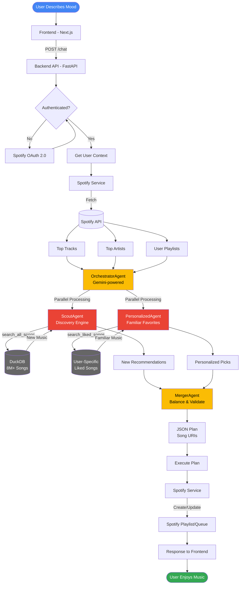

# Vibe FM - System Architecture Flowchart

## Key Components

### Frontend Layer
- **Next.js Interface**: Visual mood input with color palettes and text descriptions
- **Real-time Updates**: WebSocket-ready for live agent status

### Backend Layer (Cloud Run)
- **FastAPI Service**: RESTful API with async support
- **Spotify OAuth**: Secure authentication flow
- **Session Management**: User state persistence

### AI Agent System (ADK + Gemini)
1. **OrchestratorAgent**: Main coordinator using Gemini for mood analysis
2. **ScoutAgent**: Discovery engine searching 8M+ songs via DuckDB
3. **PersonalizedAgent**: Curates from user's listening history
4. **MergerAgent**: Balances new discoveries with familiar favorites

### Data Layer
- **DuckDB**: High-performance analytics database
  - Main tracks table: 8M+ songs with audio features
  - User-specific tables: Liked songs with preferences
- **Spotify API**: Real-time data and playback control

### Deployment
- **Google Cloud Run**: Serverless, auto-scaling containers
- **Stateless Design**: Each request is independent
- **Fast Cold Starts**: Optimized for serverless

## Data Flow Summary

1. User inputs mood → Frontend
2. Backend authenticates and fetches Spotify context
3. OrchestratorAgent analyzes mood with Gemini
4. Parallel agent execution:
   - ScoutAgent searches 8M+ song database
   - PersonalizedAgent queries user's liked songs
5. MergerAgent combines and balances results
6. Playlist created in Spotify
7. User receives perfectly curated music
